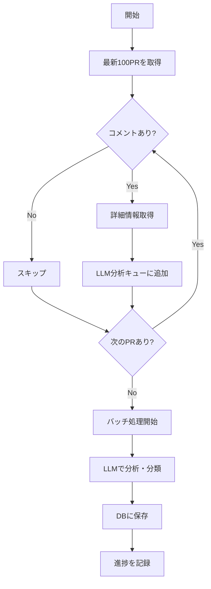

# データ収集戦略

## 概要

大量のPull Requestから効率的にレビューコメントを収集し、有用なナレッジを抽出するための戦略を定義します。

## 収集対象の優先順位付け

### 1. 時系列による優先順位

```
優先度高 ← → 優先度低
━━━━━━━━━━━━━━━━━━━━━━━━━━━━━━━━━━━━━━━━
最新PR  1ヶ月前  3ヶ月前  6ヶ月前  1年前  それ以前
```

**理由:**
- 最新のPRほど現在のコーディング規約を反映
- 古いPRは既に変更された規約を含む可能性
- 技術スタックの変化に対応

### 2. PR特性による優先順位

**高優先度のPR:**
- レビューコメント数が多い（5件以上）
- 複数のレビュアーが参加
- 議論が活発（スレッドが長い）
- マージされたPR

**低優先度のPR:**
- コメントなし
- 自動生成PR（dependabot等）
- リバートPR
- WIPやドラフトPR

## 収集フロー

### フェーズ1: 初期収集



### フェーズ2: 段階的拡張

1. **第1段階**: 最新100PR
2. **第2段階**: 過去3ヶ月のPR（コメント5件以上）
3. **第3段階**: 過去6ヶ月のPR（コメント10件以上）
4. **第4段階**: 過去1年のPR（特に重要なものに限定）

## API制限対策

### GitHub API

**レート制限:**
- 認証済み: 5,000リクエスト/時間
- GraphQL: 5,000ポイント/時間

**対策:**
```go
type RateLimiter struct {
    remaining int
    resetAt   time.Time
    mu        sync.Mutex
}

func (r *RateLimiter) Wait(ctx context.Context) error {
    r.mu.Lock()
    defer r.mu.Unlock()
    
    if r.remaining <= 10 { // バッファを持たせる
        waitTime := time.Until(r.resetAt)
        select {
        case <-time.After(waitTime):
            r.remaining = 5000
        case <-ctx.Done():
            return ctx.Err()
        }
    }
    
    r.remaining--
    return nil
}
```

### OpenAI API

**レート制限:**
- リクエスト数制限
- トークン数制限

**対策:**
- バッチ処理でまとめて送信
- 指数バックオフでリトライ
- ローカルキャッシュで重複回避

## 効率的なデータ取得

### 1. GraphQL活用

REST APIの代わりにGraphQLを使用して必要なデータのみ取得：

```graphql
query GetPRsWithComments($owner: String!, $repo: String!, $num: Int!) {
  repository(owner: $owner, name: $repo) {
    pullRequests(last: $num, states: MERGED) {
      nodes {
        number
        title
        url
        createdAt
        files(first: 100) {
          nodes {
            path
          }
        }
        reviewThreads(first: 50) {
          nodes {
            path
            line
            comments(first: 10) {
              nodes {
                author { login }
                body
                createdAt
                url
              }
            }
          }
        }
      }
    }
  }
}
```

### 2. 増分収集

```go
type CollectionState struct {
    Repository     string
    LastPRNumber   int
    LastCollectedAt time.Time
}

func (c *Collector) CollectIncremental(state CollectionState) error {
    // 前回の収集以降の新しいPRのみ取得
    newPRs := c.fetchPRsSince(state.LastPRNumber)
    
    // 既存PRの新しいコメントも確認
    updatedPRs := c.fetchUpdatedPRs(state.LastCollectedAt)
    
    return c.processAll(append(newPRs, updatedPRs...))
}
```

## LLM分析の最適化

### 1. バッチ処理

```go
type CommentBatch struct {
    Comments []Comment
    Context  string // 共通コンテキスト
}

func (a *Analyzer) AnalyzeBatch(batch CommentBatch) ([]Document, error) {
    prompt := a.buildBatchPrompt(batch)
    result := a.llm.Complete(prompt)
    return a.parseBatchResult(result)
}
```

### 2. プロンプト最適化

```
システムプロンプト:
あなたはコードレビューコメントを分析し、以下の形式で構造化するアシスタントです。

各コメントについて:
1. 要約（1-2文）
2. タイプ分類（performance/security/readability/domain/testing/architecture/style/bug/suggestion/question/other）
3. 関連タグ（最大5個）
4. 重要度スコア（0.0-1.0）

出力はJSON形式で返してください。
```

## データ品質管理

### 1. フィルタリング基準

**除外するコメント:**
- "LGTM"のみ
- 絵文字のみ
- 自動生成コメント
- 1単語のコメント

### 2. 重複排除

```go
func (p *Parser) IsDuplicate(comment Comment) bool {
    // ハッシュ計算
    hash := sha256.Sum256([]byte(comment.Body + comment.URL))
    
    // ブルームフィルタでチェック
    if p.bloomFilter.Test(hash[:]) {
        // 詳細チェック
        return p.checkInDB(hash)
    }
    
    p.bloomFilter.Add(hash[:])
    return false
}
```

## 収集スケジュール

### 初期収集
- 実行時間: 深夜帯（API利用が少ない時間）
- 見積もり時間: 
  - 100PR: 約1時間
  - 500PR: 約5時間
  - 1000PR: 約10時間

### 定期更新
- 頻度: 毎日1回
- 対象: 前日の新規PR + 更新されたPR
- 実行時間: 5-10分

## モニタリングとログ

### メトリクス収集

```go
type CollectionMetrics struct {
    TotalPRsProcessed      int
    TotalCommentsCollected int
    TotalDocumentsCreated  int
    APICallsUsed           int
    LLMTokensUsed          int
    ErrorCount             int
    Duration               time.Duration
}
```

### ログ出力

```
[INFO] Collection started: repo=owner/repo
[INFO] Fetching PRs: count=100, since=2024-01-01
[INFO] Processing PR: number=123, comments=15
[WARN] Rate limit approaching: remaining=100
[ERROR] LLM analysis failed: pr=123, error=timeout
[INFO] Collection completed: docs_created=453, duration=1h23m
```

## 失敗時の回復戦略

### 1. チェックポイント
- PR単位で進捗を保存
- 中断時は最後のチェックポイントから再開

### 2. エラーハンドリング
- 一時的エラー: 指数バックオフでリトライ
- 永続的エラー: スキップしてログに記録
- 部分的成功: 取得できたデータのみ保存

### 3. データ整合性
- トランザクション単位でDB更新
- 不完全なデータはマーク付けして後で再処理